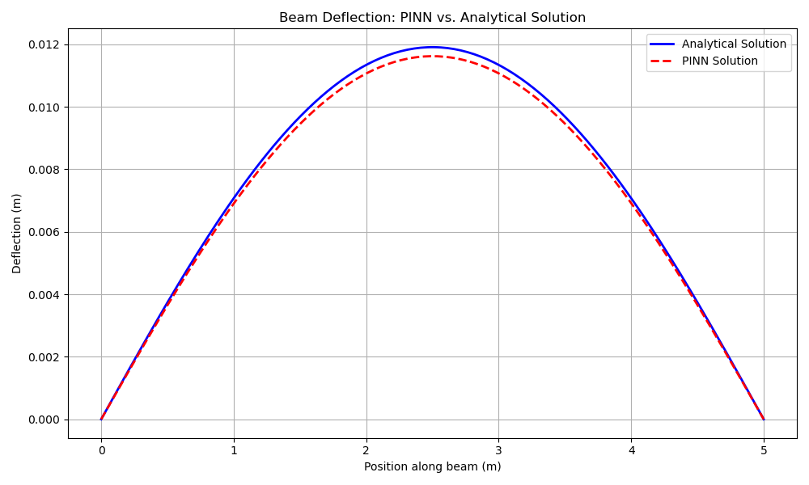

# ⚛️ Physics-Informed Neural Network for Structural Mechanics

[](https://www.python.org/)
[](https://pytorch.org/)
[](https://opensource.org/licenses/MIT)

> A deep learning model that learns the governing laws of physics to solve the Euler-Bernoulli beam equation without traditional training data.

---

## 📌 Overview

This repository contains the implementation of a **Physics-Informed Neural Network (PINN)**, a novel machine learning paradigm that integrates physical laws directly into the training process. This project demonstrates how a PINN can solve a classic structural mechanics problem—the deflection of a simply supported beam under a uniform load—by learning the underlying differential equation.

Instead of relying on a large dataset of pre-solved examples, the model learns by minimizing a loss function that penalizes violations of the governing physics and boundary conditions. This approach showcases a powerful method for solving complex engineering problems where data is scarce but the physical laws are well-understood.

---

## ⚙️ How It Works

The PINN is a standard feed-forward neural network that is trained to act as a universal function approximator. The core innovation lies in its custom loss function, which is composed of two parts:

1.  **Physics Loss:** Calculated at random "collocation points" along the beam. At each point, PyTorch's **automatic differentiation** is used to compute the derivatives of the network's output. These derivatives are plugged into the Euler-Bernoulli equation, and the "residual" (how far the solution is from satisfying the equation) is minimized.
2.  **Boundary Loss:** Enforces the known physical constraints at the beam's ends, such as zero deflection and zero bending moment.

By minimizing the combined loss, the network is forced to discover a solution that is not only consistent with the boundary conditions but also obeys the laws of physics across the entire domain.

---

## 📈 Results

The trained PINN produces a deflection curve that is nearly identical to the exact analytical solution, demonstrating its ability to successfully learn and apply the governing physical laws.



---

## 🛠️ Getting Started

### Prerequisites
Ensure you have a Python environment with the following packages installed.

```bash
# Install required packages
pip install torch numpy matplotlib tqdm
